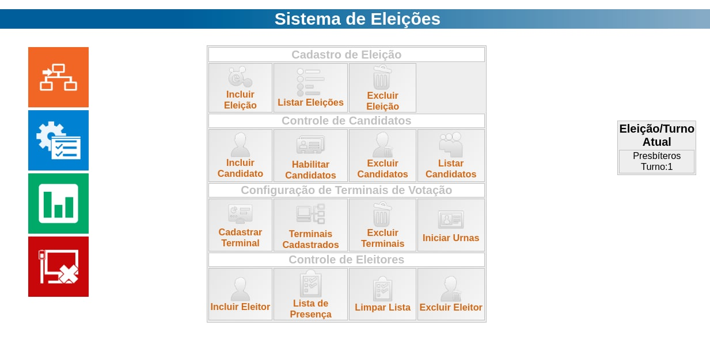

# Eleição Simples


Projeto Simples para implementação de um sistema de votação em PHP/mysql, originalmente o projeto foi feito no PHP 5.4, rodando localmente em uma maquina virtualizada, agora, para fins didaticos implementamos a usabilidade com Docker.

## 🔨 Funcionalidades do projeto

O sistema possui funcionalidades para:

- `Cadastrar Eleitores`: Controle completo para gerenciar eleitores
- `Cadastrar Terminais`: São os terminais que receberão as urnas
- `Controle de Candidatos`: Podemos gerenciar, habilitando ou não um candidato
- `Manutenção de Eleições`: Originalmente desenvolvido para atender eleições em igreja com regime presbiteriano.

## ✔️ Técnicas e tecnologias utilizadas

**O Objetivo do projeto foi demontrar como é possível disponiblizar, de forma fácil,  sistemas com tecnologias defazadas, utilizando Docker**:

- `PHP 5.4`: Versão utilizada originalmente
- `Mysql 5.7`: Persistencia
- `Docker`: Para gerenciar a infra de execução do sistema

## 📁 Acesso ao projeto

Você pode [acessar o código fonte do projeto](https://github.com/omarcoscardoso/eleicao-simples) ou [baixá-lo](https://github.com/omarcoscardoso/eleicao-simples/archive/refs/heads/main.zip).

## 🛠️ Execultando o projeto

Com o Docker e Docker-compose devidamente instalado, execulte:

```docker
docker-compose up -d --build
```

Se tudo correu bem, será retornada a seguinte mensagem:

```bash
Starting db-eleicao ... done
Starting php-eleicao ... done
```

A partir de agora você deve ter dois containers, php-eleicao e db-eleicao.

A partir da portal 8080, já é possível acessar o ambiente do sistema:

```http
http://localhost:8080
```


